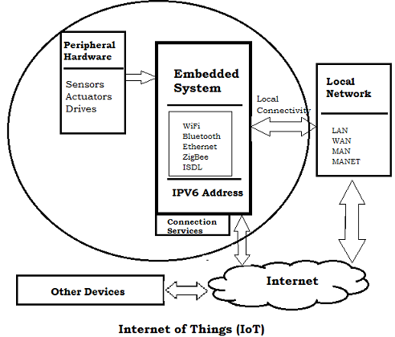
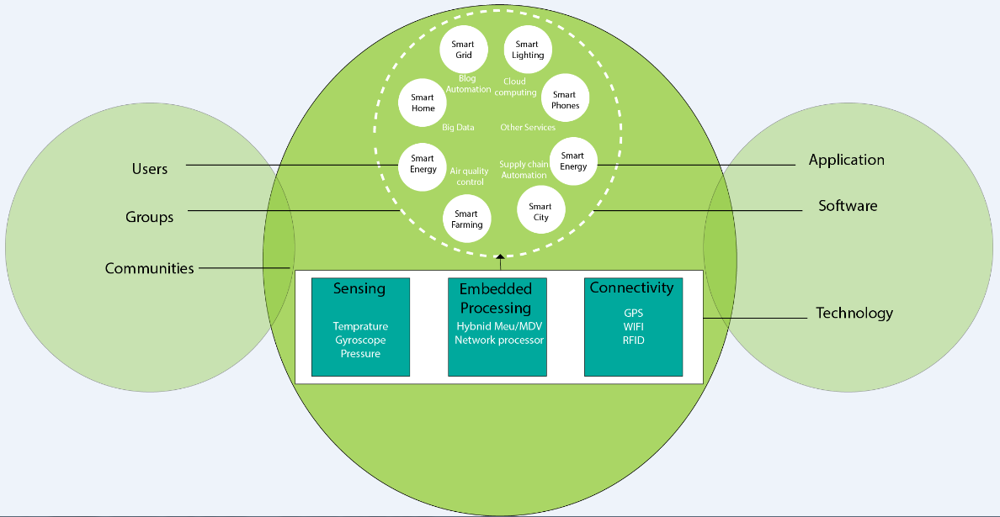
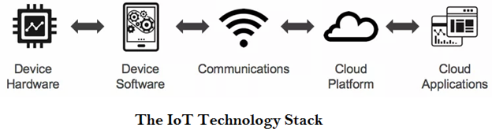

# IoT

# **Internet Of Things**

## **Unit-1**
* IoT Definition
* Characteristics
* IoT Conceptual & Architectural framework
* Components of IoT Ecosystem
* Physical and Logic Design of IoT
* IoT Enablers
* Modern Day IoT Applications
* M2M Communication
* IoT vs M2M
* IoT vs WoT
* IoT reference architecture
* IoT Network Configuration
* IoT LAN 
* IoT WAN
* IoT Node
* IoT Gateway
* IoT Proxy
* Review of Basic MicroControllers and Interfacing

## **Unit-2**
* Define Sensor
* Basic Components & Challenges of a sensor node
* Sensors Features
* Sensors Resolution
 * Sensor Classes: Analog, Digital, Scalar, 
 * Vector Sensors: Sensors Types, Bias, Drift, Hysteresis error, Quantization Error
* Actuators
* Actuators Types
 * Hydraulic 
 * Pneumatic
 * Electrical
 * Thermal/Magnetic
 * Mechanical Actuators
 * Soft Actuators  

## **Unit-3**
* Basic Of IoT Networking
* IoT Components
* Functional Components of IoT
* IoT Service Oriented Architecture
* IoT Challenges
* 6lowPAN
* IEEE 802.15.4
* ZigBee and It's types
* RFID Features 
* RFID Working and Principle and Applications
* NFC(Near Field Communication)
* Bluetooth
* Wireless Sensors & It's Applications

## **Unit-4**
* MQTT
* MQTT Methods & Components
* MQTT Communication, Topics andApplications
* SMQTT 
* CoAP
* CoAP Message Types
* CoAP Request Response Model
* XMPP
* AMQP Features & Components
* AMQP Frame Types

## **Unit-5**
* IoT Plateforms
* Arduino
* Rasberry Pi Board
* Other IoT Platforms
* Data Analyics or IoT
* Cloud for IoT
* Cloud Storage Model & Communication APIs
* Attacks in IoT System
* Vulnerability Analysis in IoT
* IoT Case-Study : Smart Home, Smart Framing 

## Some Important Facts about IoT
***
* **IoT**
  - ***ioT stands for Internet of Things which means Accessing & Conrolling devices using Intenet***
 
### **What actually is IoT?**
***
  - Let's look at your Mobile device which contains **GPS Tracking, Adaptive Brightness, Voice Detection, Face Detection etc** These components are thier own individual features but what about if these all communicate with each other to prive a better environment?
  
  - Example Phone Brightness is adjusted based on my GPS Location
  
  - Connecting everyday things embedded with Software, Sensors and Electonics to Internet enabling to collect and exchange data without Human interaction is known as **IoT**
  
  - Anything or Everything in day to day life which is accessed or connected through the internet
  
  - 
  
  > ***Iot is an advance automation and analytics system which deals with AI, Sensor, Networking, Electronic, Cloud Messaging to deliver a complete system for products or services***

  > ***IoT has greater Transparency, Control and Performance***
  
  -  In IoT we have a platform such as Cloud that contains all the data through which we connect all things around us.
    - A House, where we connect our home appliances such as AC, Light, Bell etc through each other and all these things are manage at the same platform
    
    - We connect our car track its fuel meter, speed level, location etc
       
    - AC would start before 10 minutes arrived at home, this can be also done through IoT

### **How does IoT Works?**
***
 - The working of IoT is different for different-2 IoT echo system, However The key concept there working is same.
 
 - **1. The entire working process of IoT is start with devices, Communicate with IoT Platform**
   - such as SmartPhones, Digital Watches, Electronic appliance which securely communicate with the IoT platform

 - **2. The platforms Collect and Analyze the data from all multiple devices & Platforms**

 - **3. Transfer and Share most valuable data with Application to Devices**

* **IoT Architecture**
 - 
 
### **Features of IoT**
***
 - The most important features of IoT on which it works are **Connectivity, Analyzing, Integrating, Sensing, active-engagement & amny more**
 
 - **Connectivity**
   - Connectivity means Establish a proper connection between all things of Iot to IoT plaform like server or cloud
   - After Connecting all IoT devices, It needs a high speed, secure and Bi-directional communication.
  
 - **Analyzing**
   - Analyzing means the data which we gather perform Analytics on it, use good insights of data to make our system smart and efeective business intelligence
  
 - **Integration**
   - IoT integrating various model to improve the user experience.

 - **AI**
   - IoT makes things smart and enhance life through use of data.
   
 - **Sensing**
   - The sensors devices used in IoT to detect and measure any changes in environment and report it's status
   - Without sensors there could not hold effectiveness
   
 - **Active-Engagement**
   - IoT makes the connected Products or services or Technology to active engagement between each other

 - **EndPoint Management**
   - It is important to be the end-point management of all the IoT System otherwise It makes the complete failure of the system
 

### **Advantages of IoT**
***
 - IoT facilitates the several advantages in day to day life in the Business sector
 
 - **Effective Resource Utilization**
 
 - **Minimize Human Efforts**
 
 - **Save Time**
 
 - **Enhance Data Collection**
 
 - **Improve Security**
 
### **Disadvantages Of IoT**
***
 - As the IoT facilitates a set of benefits, it also creates a significant set of challenges
 
 - **Security**
   - IoT System are interconncted and communicate over networks.
   - The system offers little control despite any security measure and it can be lead the various kind of network attacks.
  
 - **Privacy**
   - Even without the active participation on the users , IoT system provides substancial personal data in maximum detail
 
 - **Complexity**
   - The designing, developing and maintaining and enabling the large technology to IoT is quite complicated

### **Embedded Devices in IoT**
***
- The term Embedded System is important in IoT
- The embedded devices are the objects that build unique computing system.
- The embedded sysyem may orn may not be connected to interet

- An Embedded device system generally runs as a single application. However these devices can connect through internet and able to communicate through other network devices

* **Embedded System Hardware**
- The embedded system can be of type **MicroController** and **MicroProcessor**

> ***Micro-Controller : A microcontroller is a chip optimized to control electronic devices.\
 It is stored in a single integrated circuit which is dedicated to performing a particular task and execute one specific application***

> ***Micro-Processor : A microprocessor is a controlling unit of a micro-computer wrapped inside a small chip.\It performs Arithmetic Logical Unit (ALU) operations and communicates with the other devices connected with it.\ It is a single Integrated Circuit in which several functions are combined.***

* **Micro-Controller vs Micro-Processor**
  | **Micro-Processor**        | **Micro-Controller**| 
  |------------------------|-------------------|
  |Microprocessor consists of only a Central Processing Unit|whereas Micro Controller contains a CPU, Memory, I/O all integrated into one chip.|
  |Microprocessor is used in Personal Computers |Micro Controller is used in an embedded system.|
  |Microprocessor uses an external bus to interface to RAM, ROM, and other peripherals|on the other hand, Microcontroller uses an internal controlling bus.|
  |Microprocessors are based on Von Neumann model|Micro controllers are based on Harvard architecture|
  |Microprocessor is complicated and expensive, with a large number of instructions to process|Microcontroller is inexpensive and straightforward with fewer instructions to process.|

* 

* **Emndeded System Software**
- The Embedded System that uses the devices for the Operating system is based on language platform, mainly where the real-time operation would be performed.
  - Manufacturers builds Embedded Software in eletronics
  
  - | Objects | Softwares    |
    |-------|-----|
    |  Cars |    |
    | Telephones |  |
    | Appliances  |  |
    | Modems  | |
    | Light |   |
  
  - These Embedded system software are simple running onn 8-bit Mircocontroller  

> ***Software for Missiles, Aeroplanes, Ships etc are complicated software for process control system**

### **IoT EcoSystem**
***
- IoT EcoSystem is a connection of various kind of devices that **Sense and Analyze the data and Communicate with each other over the networks**

- In IoT EcoSystem, user uses Smart-Devices like SmartPhone, tablet, Sensors, SmartWatches, Car etc to send command or requests to the device information over network

- The Device responses and performs the command and send Information back.

- The IoT is itself a ecosystem of network devices that transfer data.
  * ***Sensing, Ebedded Processing, Connectivity*** 
  
  * ***Smart Devices & Environment, Cloud Computing, Big Data***
  
  * ***Technology, Software, Application***
  
  * ***Users or Groups of Community***  
   
  * 
  

### **IoT Decision FrameWork**
***
- The IoT Decision Framework povides a **Structured Approach** to create a Poerful IoT Product

- IoT Decision Framework is all about the Strategic Decision Making

- The Five different layers of technology
  - ***1. Device Hardware***
  - ***2. Device Software***
  - ***3. Communications***
  - ***2. Cloud Platform***
  - ***2. Cloud Application***
- 

### **Decision Area**
***
- IoT Decision framework pays attenstions to six key decisions areas in IoT Product
 - ***User Experience (UX)***
 - ***Data***
 - ***Business***
 - ***Technology***
 - ***Security***
 - ***Standards & Regulations***
 

### **IoT Architecture**
***
- IoT architecture mainly consists of 4 major components
  - ***1. Sensors or Actuators***
  - ***2. Device***
  - ***3. Gateways***
  - ***4. Cloud***
  
### **IoT BioMetrics Domain**
***
- IoT plays a vital role in the BioMetric Security System such as **FingerPrint-System, Voice-Recognition, Eye-Scanner etc**

- BioMetrics system is something we always encounter in our daily life either fingerprint, eyeScanner, Facelock etc depends on organizations.

* How these system workd?
  - A person presents its finger on fingerprint scanner and it scans the fingerprint and this is the part of enrollment process
  - Frpm this fingerprint template, the device extract certain keys features which make a different from others
  - Store it to a DataBase
  - After that Every time same person place its finger to fingerprint scanner, it compare this keys according to that persons
  

### **IoT in Security Camera & Door UnLock System**
***
- The security camera & Door Unlock system is something that is quite interesting IoT application

- We place a camera on the top foot of door which in turn clicks the photo of a person comes into frame.
- This photo is sent to Analytical System which compare this to all photo
- Process to identify whether to user Open door or not

### **IoT Smart Home & Smart City**

### **IoT Smart Agriculture**

### **Smart Irrigation System**

### **Health care**
***
- IoT brings numerous applications in HealthCare from  Remote Monitoring to Smart Sensors to Medical Integration.

- It keeps the Patient Safe and Healthy  as well as improve

- Health-Care Devices collects diverse data from a large set of real world cases that increases the accuracy and the size of medical data

- Factor Affecting IoT HealthCare
  - ***Continuous Research***
  - ***Smart Devices***
  - ***Better Care***
  - ***Medical Information Distribution***
  
- IoT challeges in HealthCare
  - ***Data Security & Privacy***
  - ***Integration***
  - ***Data Overload & Accuracy***
  - ***Cost***
  

### **IoT transforming Business**
***
- IoT is tranforming the business enterprises by creating the oppotunities to get smarter about the product, services and the customer experience
  - **Improving Customer Experience**
  - **Greater Efficiency**
  - **More Data - More Opportunity**
  - **Creating New Business Models**
  - **Cost Reduction and Gain Productivity**
  - **Asset Tracking & Waste Reduction**
  

### **Smart Object**
***
- **SmartPhone**
- **Tablet**
- **Smart TV**
- **Computer**
- **Smart Watch**

### **IoT vs M2M**
***
| **Internet of Things** | **Machine to Machine**|
|------------------------|-----------------------|
|Devices have objects that are responsible for decision making|Some degree of intelligence is observed in this|
|The connection is via Network and using various communication types.|The connection is a point to point|
|Internet protocols are used such as HTTP, FTP, and Telnet.|Traditional protocols and communication technology techniques are used|
|Data is shared between other applications that are used to improve the end-user experience.|Data is shared with only the communicating parties.|
|Internet connection is required for communication|Devices are not dependent on the Internet.|
|A large number of devices yet scope is large.|Limited Scope for devices.|
|Business 2 Business(B2B) and Business 2 Consumer(B2C)|Business 2 Business (B2B)|
|Supports Open API integrations|There is no support for Open Api’s|
Smart wearables, Big Data and Cloud, etc.|Sensors, Data and Information, etc.|
