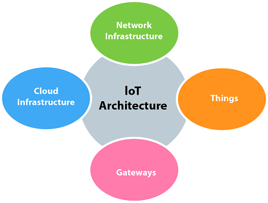

# IoT

# **Internet Of Things**

## **Unit-1**
* IoT Definition
* Characteristics
* IoT Conceptual & Architectural framework
* Components of IoT Ecosystem
* Physical and Logic Design of IoT
* IoT Enablers
* Modern Day IoT Applications
* M2M Communication
* IoT vs M2M
* IoT vs WoT
* IoT reference architecture
* IoT Network Configuration
* IoT LAN 
* IoT WAN
* IoT Node
* IoT Gateway
* IoT Proxy
* Review of Basic MicroControllers and Interfacing

## **Unit-2**
* Define Sensor
* Basic Components & Challenges of a sensor node
* Sensors Features
* Sensors Resolution
 * Sensor Classes: Analog, Digital, Scalar, 
 * Vector Sensors: Sensors Types, Bias, Drift, Hysteresis error, Quantization Error
* Actuators
* Actuators Types
 * Hydraulic 
 * Pneumatic
 * Electrical
 * Thermal/Magnetic
 * Mechanical Actuators
 * Soft Actuators  

## **Unit-3**
* Basic Of IoT Networking
* IoT Components
* Functional Components of IoT
* IoT Service Oriented Architecture
* IoT Challenges
* 6lowPAN
* IEEE 802.15.4
* ZigBee and It's types
* RFID Features 
* RFID Working and Principle and Applications
* NFC(Near Field Communication)
* Bluetooth
* Wireless Sensors & It's Applications

## **Unit-4**
* MQTT
* MQTT Methods & Components
* MQTT Communication, Topics andApplications
* SMQTT 
* CoAP
* CoAP Message Types
* CoAP Request Response Model
* XMPP
* AMQP Features & Components
* AMQP Frame Types

## **Unit-5**
* IoT Plateforms
* Arduino
* Rasberry Pi Board
* Other IoT Platforms
* Data Analyics or IoT
* Cloud for IoT
* Cloud Storage Model & Communication APIs
* Attacks in IoT System
* Vulnerability Analysis in IoT
* IoT Case-Study : Smart Home, Smart Framing 

## Some Important Facts about IoT
***
* **IoT**
  - ***ioT stands for Internet of Things which means Accessing & Conrolling devices using Intenet***
 
* What actually is Iot?
  - Let's look at your Mobile device which contains **GPS Tracking, Adaptive Brightness, Voice Detection, Face Detection etc** These components are thier own individual features but what about if these all communicate with each other to prive a better environment?
  
  - Example Phone Brightness is adjusted based on my GPS Location
  
  - Connecting everyday things embedded with Software, Sensors and Electonics to Internet enabling to collect and exchange data without Human interaction is known as **IoT**
  
  - Anything or Everything in day to day life which is accessed or connected through the internet
  
  - 
  
  > ***Iot is an advance automation and analytics system which deals with AI, Sensor, Networking, Electronic, Cloud Messaging to deliver a complete system for products or services***

  > ***IoT has greater Transparency, Control and Performance***
  
  -  In IoT we have a platform such as Cloud that contains all the data through which we connect all things around us.
    - A House, where we connect our home appliances such as AC, Light, Bell etc through each other and all these things are manage at the same platform
    
    - We connect our car track its fuel meter, speed level, location etc
       
    - AC would start before 10 minutes arrived at home, this can be also done through IoT

* How does IoT Works?
 - The working of IoT is different for different-2 IoT echo system, However The key concept there working is same.
 
 - **1. The entire working process of IoT is start with devices, Communicate with IoT Platform**
   - such as SmartPhones, Digital Watches, Electronic appliance which securely communicate with the IoT platform

 - **2. The platforms Collect and Analyze the data from all multiple devices & Platforms**

 - **3. Transfer and Share most valuable data with Application to Devices**

* IoT Architecture
 - 
 
* Features of IoT
 - The most important features of IoT on which it works are **Connectivity, Analyzing, Integrating, Sensing, active-engagement & amny more**
 
 - **Connectivity**
   - Connectivity means Establish a proper connection between all things of Iot to IoT plaform like server or cloud
   - After Connecting all IoT devices, It needs a high speed, secure and Bi-directional communication.
  
 - **Analyzing**
   - Analyzing means the data which we gather perform Analytics on it, use good insights of data to make our system smart and efeective business intelligence
  
 - **Integration**
   - IoT integrating various model to improve the user experience.

 - **AI**
   - IoT makes things smart and enhance life through use of data.
   
 - **Sensing**
   - The sensors devices used in IoT to detect and measure any changes in environment and report it's status
   - Without sensors there could not hold effectiveness
   
 - **Active-Engagement**
   - IoT makes the connected Products or services or Technology to active engagement between each other

 - **EndPoint Management**
   - It is important to be the end-point management of all the IoT System otherwise It makes the complete failure of the system
 

* Advantages of IoT
 - IoT facilitates the several advantages in day to day life in the Business sector
 
 - **Effective Resource Utilization**
 
 - **Minimize Human Efforts**
 
 - **Save Time**
 
 - **Enhance Data Collection**
 
 - **Improve Security**
 
* Disadvantages Of IoT
 - As the IoT facilitates a set of benefits, it also creates a significant set of challenges
 
 - **Security**
   - IoT System are interconncted and communicate over networks.
   - The system offers little control despite any security measure and it can be lead the various kind of network attacks.
  
 - **Privacy**
   - Even without the active participation on the users , IoT system provides substancial personal data in maximum detail
 
 - **Complexity**
   - The designing, developing and maintaining and enabling the large technology to IoT is quite complicated
